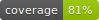

[](https://github.com/inquirex/inquirex-tty/actions/workflows/main.yml)  

# inquirex-tty

Terminal adapter for the [Inquirex](https://github.com/inquirex/inquirex) questionnaire engine. Renders flow definitions as interactive ANSI terminal wizards using [tty-prompt](https://github.com/piotrmurach/tty-prompt), with ASCII-art headers, styled boxes, and automatic widget selection based on data types.

Ships as a CLI (`inquirex`) with commands to run flows interactively, validate definitions, and export Mermaid diagrams.

## Status

- Version: `0.2.1`
- Ruby: `>= 4.0.0`
- Depends on: `inquirex`, `tty-prompt`, `tty-box`, `tty-font`, `pastel`, `dry-cli`

## Installation

```ruby
gem "inquirex-tty"
```

The gem installs an `inquirex` executable.

## Quick Start

Write a flow definition in Ruby:

```ruby
# my_flow.rb
require "inquirex"

Inquirex.define id: "hello", version: "1.0.0" do
  meta title: "Hello World"
  start :name

  ask :name do
    type :string
    question "What is your name?"
    transition to: :age
  end

  ask :age do
    type :integer
    question "How old are you?"
    transition to: :farewell
  end

  say :farewell do
    text "Thanks for chatting!"
  end
end
```

Run it:

```bash
inquirex run my_flow.rb
```

The CLI walks the user through each step, selecting the appropriate TTY widget for each data type, and prints collected answers as JSON when the flow completes.

## CLI Commands

### `inquirex run <flow_file>`

Execute a flow interactively. Each step is rendered with the appropriate tty-prompt widget based on the node's data type and widget hints.

```bash
inquirex run examples/08_tax_preparer.rb
inquirex run examples/08_tax_preparer.rb --output results.json
```

Options:

| Flag | Description |
|------|-------------|
| `--output`, `-o` | Write JSON results to a file instead of stderr |

On completion, outputs a JSON summary:

```json
{
  "flow_file": "examples/08_tax_preparer.rb",
  "path_taken": [
    "intro", "filing_status", "dependents", "income_types",
    "state_filing", "foreign_accounts", "deduction_types",
    "client_name", "client_email", "thanks"
  ],
  "answers": {
    "filing_status": "single",
    "dependents": 2,
    "income_types": ["W2", "1099"],
    "state_filing": ["California"],
    "foreign_accounts": "no",
    "deduction_types": ["Medical"],
    "client_name": "Konstantin Gredeskoul",
    "client_email": "kigster@gmail.com"
  },
  "steps_completed": 10,
  "completed_at": "2026-04-13T23:51:33-07:00"
}
```

### `inquirex validate <flow_file>`

Check that a flow definition is well-formed without running it. Validates:

- Start step exists in the step list
- All transition targets reference known steps
- All steps are reachable from the start step (detects orphans)

```bash
inquirex validate examples/08_tax_preparer.rb
```

### `inquirex graph <flow_file>`

Export the flow as a [Mermaid](https://mermaid.js.org/) diagram source, an image, or both.

```bash
inquirex graph examples/08_tax_preparer.rb                                       # Mermaid source to stdout
inquirex graph examples/08_tax_preparer.rb --output flow.mmd                     # write source to a file
inquirex graph examples/08_tax_preparer.rb --format image -o flow.svg            # SVG via mmdc
inquirex graph examples/08_tax_preparer.rb --format both --output ~/Desktop      # source + image into a directory
inquirex graph examples/08_tax_preparer.rb --format image --open                 # SVG + open in viewer
```

Options:

| Flag | Description |
|------|-------------|
| `--output`, `-o` | Output file or directory (default: stdout) |
| `--format`, `-f` | `source` (default), `image` (SVG via `mmdc`), or `both` |
| `--open`, `-p` | Open the generated image in the system viewer (default: false) |

Image generation requires [mermaid-cli](https://github.com/mermaid-js/mermaid-cli) (`npm install -g @mermaid-js/mermaid-cli`). The command attempts to install it automatically if `mmdc` is not on your `PATH`.

### `inquirex export <flow_file>`

Export the flow definition as JSON or YAML. Useful for serving flows to frontend adapters (the JS widget, Rails API, etc.) or for inspecting the wire format.

```bash
inquirex export examples/08_tax_preparer.rb                          # pretty JSON to stdout
inquirex export examples/08_tax_preparer.rb -f yml                   # YAML to stdout
inquirex export examples/08_tax_preparer.rb -o .                     # write 08_tax_preparer.json to cwd
inquirex export examples/08_tax_preparer.rb -f yml -o ~/flows        # write 08_tax_preparer.yml to ~/flows
inquirex export examples/08_tax_preparer.rb -o out.json              # write to named file
inquirex export examples/08_tax_preparer.rb -f yml -o out            # appends .yml → out.yml
```

Options:

| Flag | Description |
|------|-------------|
| `--format`, `-f` | `json` (default), `yaml`, or `yml` |
| `--output`, `-o` | Output file or directory (default: stdout) |

Output path rules:

- No `--output` → print to stdout
- `--output <dir>` (existing directory) → write `<flow-basename>.<ext>` inside it
- `--output <file>` → use that filename; if the extension is missing or mismatched, the appropriate one (`.json`/`.yml`) is substituted

### `inquirex version`

Print version information for the TTY adapter and its dependencies.

```bash
inquirex version
```

## Example Session

Running the tax preparation intake example:

```
$ inquirex run examples/08_tax_preparer.rb

  _____      _     __  __   ____    ____    _____   ____       _      ____       _      _____   ___    ___    _   _    ___   _   _   _____      _      _  __  _____
 |_   _|    / \    \ \/ /  |  _ \  |  _ \  | ____| |  _ \     / \    |  _ \     / \    |_   _| |_ _|  / _ \  | \ | |  |_ _| | \ | | |_   _|    / \    | |/ / | ____|
   | |     / _ \    \  /   | |_) | | |_) | |  _|   | |_) |   / _ \   | |_) |   / _ \     | |    | |  | | | | |  \| |   | |  |  \| |   | |     / _ \   | ' /  |  _|
   | |    / ___ \   /  \   |  __/  |  _ <  | |___  |  __/   / ___ \  |  _ <   / ___ \    | |    | |  | |_| | | |\  |   | |  | |\  |   | |    / ___ \  | . \  | |___
   |_|   /_/   \_\ /_/\_\  |_|     |_| \_\ |_____| |_|     /_/   \_\ |_| \_\ /_/   \_\   |_|   |___|  \___/  |_| \_|  |___| |_| \_|   |_|   /_/   \_\ |_|\_\ |_____|

━━━━━━━━━━━━━━━━━━━━━━━━━━━━━━━━━━━━━━━━━━━━━━━━━━━━━━━━━━━━━━━━━━━━━━━━━━━━━━━━
Step 2: intro
━━━━━━━━━━━━━━━━━━━━━━━━━━━━━━━━━━━━━━━━━━━━━━━━━━━━━━━━━━━━━━━━━━━━━━━━━━━━━━━━

Please describe your tax situation in a few sentences.
Do not under any circumstances provide personal information,
such as your address or social security number.

Example: I have two W-2s from my two jobs, a rental property, and a side business.
Press any key to continue...
━━━━━━━━━━━━━━━━━━━━━━━━━━━━━━━━━━━━━━━━━━━━━━━━━━━━━━━━━━━━━━━━━━━━━━━━━━━━━━━━
Step 3: filing_status
━━━━━━━━━━━━━━━━━━━━━━━━━━━━━━━━━━━━━━━━━━━━━━━━━━━━━━━━━━━━━━━━━━━━━━━━━━━━━━━━
What is your filing status for 2025? single
Step 4: dependents
━━━━━━━━━━━━━━━━━━━━━━━━━━━━━━━━━━━━━━━━━━━━━━━━━━━━━━━━━━━━━━━━━━━━━━━━━━━━━━━━
How many dependents do you have? 2
Step 5: income_types
━━━━━━━━━━━━━━━━━━━━━━━━━━━━━━━━━━━━━━━━━━━━━━━━━━━━━━━━━━━━━━━━━━━━━━━━━━━━━━━━
Select all income types that apply to you in 2025. W2, 1099
Step 6: state_filing
━━━━━━━━━━━━━━━━━━━━━━━━━━━━━━━━━━━━━━━━━━━━━━━━━━━━━━━━━━━━━━━━━━━━━━━━━━━━━━━━
Which states do you need to file in? California
Step 7: foreign_accounts
━━━━━━━━━━━━━━━━━━━━━━━━━━━━━━━━━━━━━━━━━━━━━━━━━━━━━━━━━━━━━━━━━━━━━━━━━━━━━━━━
Do you have any foreign financial accounts? no
Step 8: deduction_types
━━━━━━━━━━━━━━━━━━━━━━━━━━━━━━━━━━━━━━━━━━━━━━━━━━━━━━━━━━━━━━━━━━━━━━━━━━━━━━━━
Which additional deductions apply to you? Medical
Step 9: client_name
━━━━━━━━━━━━━━━━━━━━━━━━━━━━━━━━━━━━━━━━━━━━━━━━━━━━━━━━━━━━━━━━━━━━━━━━━━━━━━━━
Your name, please: Konstantin Gredeskoul
Step 10: client_email
━━━━━━━━━━━━━━━━━━━━━━━━━━━━━━━━━━━━━━━━━━━━━━━━━━━━━━━━━━━━━━━━━━━━━━━━━━━━━━━━
Your email address: kigster@gmail.com
Step 11: thanks
━━━━━━━━━━━━━━━━━━━━━━━━━━━━━━━━━━━━━━━━━━━━━━━━━━━━━━━━━━━━━━━━━━━━━━━━━━━━━━━━

Thank you! We will review your information and send you a
tax preparation estimate within 1-2 business days.
Press any key to continue...
```

## Widget Mapping

The renderer selects a tty-prompt method for each node based on the `:tty` widget hint from `WidgetRegistry`:

| Widget Hint | tty-prompt Method | Used For |
|-------------|-------------------|----------|
| `text_input` | `prompt.ask` | `:string`, `:date`, `:email`, `:phone` |
| `multiline` | `prompt.multiline` | `:text` |
| `number_input` | `prompt.ask` (with `convert:`) | `:integer`, `:decimal`, `:currency` |
| `yes_no` | `prompt.yes?` | `:boolean` / `confirm` |
| `select` | `prompt.select` | `:enum` |
| `multi_select` | `prompt.multi_select` | `:multi_enum` |
| `enum_select` | `prompt.enum_select` | Numbered menu variant |
| `mask` | `prompt.mask` | Password/hidden input |
| `slider` | `prompt.slider` | Numeric range |

You can override the default by setting an explicit `:tty` widget hint in the DSL:

```ruby
ask :priority do
  type :enum
  question "How urgent?"
  options low: "Low", medium: "Medium", high: "High"
  widget target: :tty, type: :enum_select   # numbered menu instead of arrow-key select
  transition to: :next_step
end
```

## Display Verbs

| Verb | Rendering |
|------|-----------|
| `header` | Large ASCII-art text via TTY::Font (falls back to TTY::Box) |
| `say` | Plain text with "Press any key to continue..." |
| `btw` | Info-styled box (blue border) |
| `warning` | Warning-styled box (yellow/red) |

## Examples

The gem ships with 8 examples of increasing complexity:

| Example | Description | Steps | Features |
|---------|-------------|-------|----------|
| `01_hello_world.rb` | Minimal flow | 3 | String and integer input |
| `02_yes_or_no.rb` | Boolean branching | 3 | `confirm`, `equals` rule |
| `03_food_preferences.rb` | Multi-select branching | 6 | `multi_enum`, `contains` rule |
| `04_event_registration.rb` | Two-level branching | 9 | Nested conditionals |
| `05_job_application.rb` | Composed rules | 13 | `all()`, `any()`, `greater_than` |
| `06_health_assessment.rb` | Three-level branching | 18 | Complex composed rules |
| `07_loan_application.rb` | Real-world loan intake | 20+ | Currency, 3-level branching |
| `08_tax_preparer.rb` | Full tax preparation wizard | 18+ | All data types, deep branching |

Run any example:

```bash
inquirex run examples/01_hello_world.rb
inquirex run examples/08_tax_preparer.rb
```

Validate all examples:

```bash
for f in examples/*.rb; do inquirex validate "$f"; done
```

## Architecture

```
inquirex-tty/
├── exe/inquirex                    # CLI entry point (dry-cli)
└── lib/inquirex/tty/
    ├── commands/
    │   ├── run.rb                  # Interactive flow execution
    │   ├── validate.rb             # Definition validation
    │   ├── graph.rb                # Mermaid diagram export
    │   ├── export.rb               # JSON / YAML serialization
    │   └── version.rb              # Print version info
    ├── renderer.rb                 # Node → tty-prompt widget dispatcher
    ├── flow_loader.rb              # Load .rb flow definitions
    ├── output_path.rb              # Shared -o/--output path resolution
    ├── ui_helper.rb                # TTY::Box/Pastel/Screen helpers
    └── commands.rb                 # dry-cli command registry
```

### Renderer

`Inquirex::TTY::Renderer` is the core class that maps nodes to tty-prompt calls. It reads the `:tty` widget hint from each node (via `WidgetRegistry` defaults or explicit DSL hints) and dispatches to the matching `render_*` method.

The `TTY::Prompt` instance is injectable for testing:

```ruby
prompt = TTY::Prompt::Test.new
renderer = Inquirex::TTY::Renderer.new(prompt:)
```

### FlowLoader

Loads a `.rb` file and evaluates it to produce an `Inquirex::Definition`. The file must contain an `Inquirex.define` call that returns the definition.

### UIHelper

A mixin module providing styled output helpers (`box`, `info`, `success`, `error`, `warning`, `sep`, `next_step`) built on TTY::Box, Pastel, and TTY::Screen. Included automatically in all CLI commands and the Renderer.

## Development

```bash
bin/setup                           # install dependencies
bundle exec rspec                   # run tests
bundle exec rspec --format doc      # verbose test output
bundle exec rubocop                 # lint
```

### Useful `just` tasks

```bash
just test                           # run full test suite with coverage
just lint                           # rubocop
just format                         # rubocop --auto-correct
just run examples/01_hello_world.rb # run a flow
just validate examples/01_hello_world.rb
just graph examples/01_hello_world.rb
just examples                       # validate all examples
just ci                             # tests + lint
```

### Writing a Custom Flow

Any `.rb` file that calls `Inquirex.define` and returns a `Definition` works:

```ruby
require "inquirex"

Inquirex.define id: "my-flow", version: "1.0.0" do
  meta title: "My Flow"
  start :first_question

  ask :first_question do
    type :enum
    question "Pick one:"
    options a: "Option A", b: "Option B", c: "Option C"
    widget target: :tty, type: :select
    transition to: :detail, if_rule: equals(:first_question, "a")
    transition to: :done
  end

  ask :detail do
    type :text
    question "Tell me more about A:"
    transition to: :done
  end

  say :done do
    text "All done!"
  end
end
```

## License

MIT. See [LICENSE.txt](LICENSE.txt).

Copyright 2026 Konstantin Gredeskoul & Inquirex.
