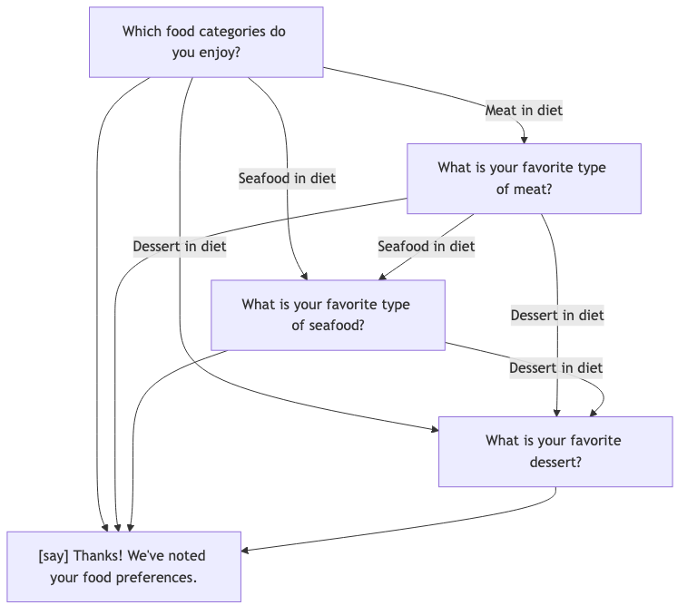

# Examples

This folder contains examples of the Ruby DSL that is converted in the question/answer
dialog with the end-user and results in the single JSON file containing all the answers.

The binary that comes with this gem supports multiple sub-commands:

```text
❯ inquirex
Commands:
  inquirex export FLOW_FILE    # Export a flow definition as JSON or YAML .
  inquirex graph FLOW_FILE     # Export a flow definition as a Mermaid diagram source, an image, or both.
  inquirex run FLOW_FILE       # Run a flow definition interactively
  inquirex validate FLOW_FILE  # Validate a flow definition file
  inquirex version             # Print version information
```

Each command supports `--help` of its own.

## Flow File

The argument `FLOW_FILE` in the above help definition is a ruby file, just like the ones
contained in this folder. If you modify it, or write your own, the first you should likely take
is to run `validate` subcommand on this file.

For instance, let's validate the simple questionare about your food preferences:

### Validation

```bash
❯ inquirex validate 03_food_preferences.rb
Flow definition is valid!
  ID:          food-preferences
  Version:     1.0.0
  Start step:  diet
  Total steps: 5
  Steps:       diet, meat_preference, seafood_preference, dessert_preference, summary
  Title:    Food Preferences
  Subtitle: Tell us what you enjoy
```

If the file is valid, most likely all the other commands will work as well.

You may want to start with `graph` to visualize the flow of the questions on the aptly named "flow chart":



We deliberately used a very simple DSL file, because for a more complex (and likely more realistic) scenario
the flow chart could be enormous and difficult to follow. Sometimes it's easier to follow the DSL than it is
to understand the graph.
